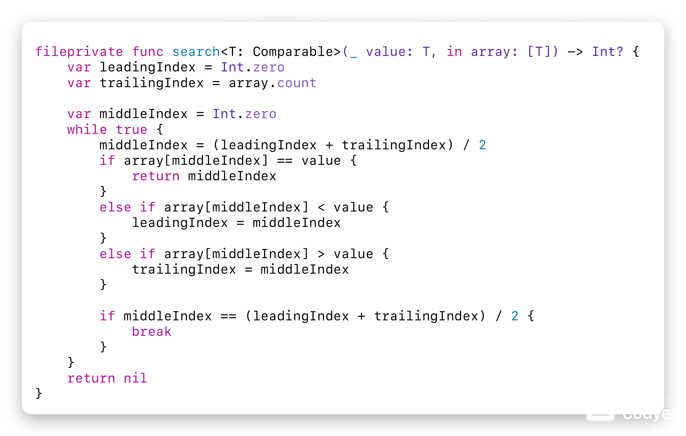

# LeetCode
## Table of Contents
1. Easy
    1. 704\. Binary Search
3. Medium
    1. 2\. Add Two Numbers
    2. 75\. Sort Color
4. Hard

## Easy
There is 1 easy problem.

### 704. Binary Search
#### Quick Look

#### Files
1. [`./easy/704_binary_search.swift`](./easy/704_binary_search.swift)

## Medium
There are 2 medium problems.

### 2. Add Two Numbers
#### Quick Look

#### Files
1. [`./medium/2_add_two_numbers.cpp`](./medium/2_add_two_numbers.cpp)

### 75. Sort Colors
#### Quick Look

#### Files
1. [`./medium/75_sort_colors.swift`](./medium/75_sort_colors.swift)

## Hard
